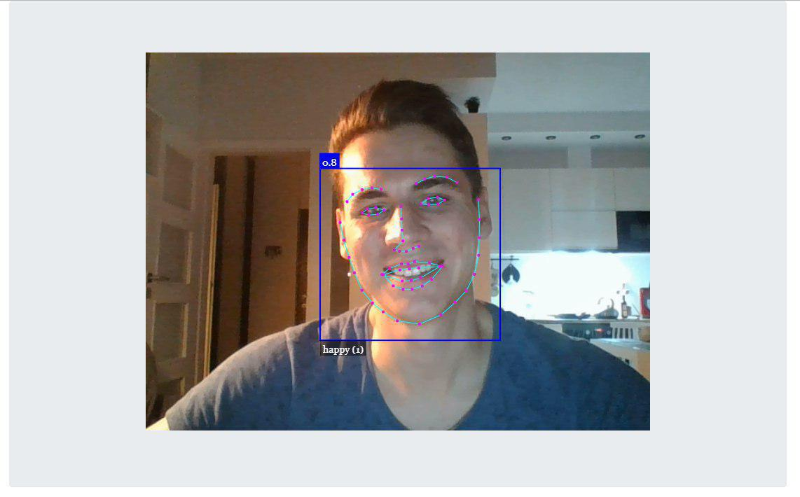

<h1 align="center">Face Recognition</h1>

<div align="center">
  <sub>The little face detection that detects faces. Codede by
    <a href="https://github.com/Grinzzly">Grinzzly</a>
  </sub>
  <br>
  <br>
  
  <br>
  <br>
  <a href="https://github.com/airbnb/javascript">
        
  </a>
  &nbsp;
  
</div>

## About
Sooner of later every dev writes face detection software.

You may observe result [here](https://face-recognition.simplexco.de).


<sub align="center">Nah. Not that one</sub>


<sub align="center">1 night and 99 cups of coffee latter</sub>

## Installation & Usage

From the root of the project directory:
```
npm i
npm run start
```
_Use at least 8.9.0 version of Node._
## Technology in use

* __ReactJS based App__
* __Face-api__
* __Modernizr__
* __Gif.js__
